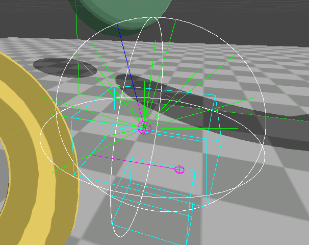
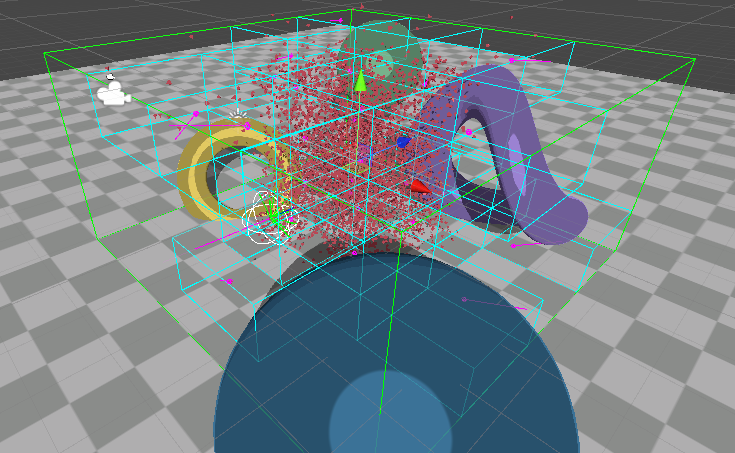

# Boids

  

Parallel implementation of Boids using the Unity Job System.
It implements the three main behaviors listed in [Boids by Craig Raynolds](https://www.red3d.com/cwr/boids/):

- Alignment.
- Separation.
- Cohesion.

It also implements collision avoidance and interest points to force the Boids into different places.
The movement is force-based, so additional behaviors can be easily added with a Job that just sums its results to the forces applied.

  

In order to parallelize this process the simulation area is divided into small boxes that we will use as the Boid sight, it's not perfect because a Boid can be on the edge of a box looking outside and will be influenced by the Boids behind him instead of the ones that are in front of him because it can't see them.

  

## Video
You can see a short video of the implementation [here](https://youtu.be/qqIMY8fuibg).

# Known Issues
- The update system is separated into two main parts, movement simulation, and forces update. Forces update is where all the heavy calculations are done and it might take dozens of milliseconds per update, on the other hand, movement simulation only applies the current forces, this creates situations where the Boids do things they are not supposed to do, like escaping the simulation area because there is no new force data to be applied.
- The forces are applied instantaneously, this results in sharp turning and choppy movement.
- To avoid collisions each boid launches several rays in order to find a free direction but a lot of times these rays do not hit anything, this process takes too long.